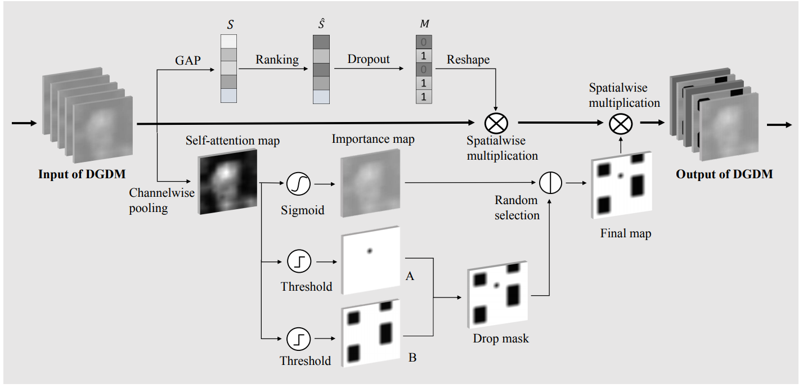

 # Dual-attention Guided Dropblock Module
Unofficial Tensorflow Implementation of Dual-attention Guided Dropblock Module 

Dual-attention Guided Dropblock Module for Weakly Supervised Object Localization(https://arxiv.org/abs/2003.04719)

# Reference  

[ADL](https://github.com/junsukchoe/ADL) Attention-based Dropout Layer for Weakly Supervised Object Localization(https://arxiv.org/1908.10028) 